# Android Omok_game

## About
- 안드로이드 프랫폼의 기기 한대로 두명의 사용자가 즐길 수 있는 게임을 구현해 본다.
- 한수 무르기, 시간 제한 두기 등의 아이템을 이용하여 전략을 다양하게 만들어 본다.
- 각 플레이어의 차례를 네온색상의 이미지로 표현
- 가장 마지막에 놓인 돌의 위치를 체크하여 빨간 점으로 표시해본다.

## Preview
| 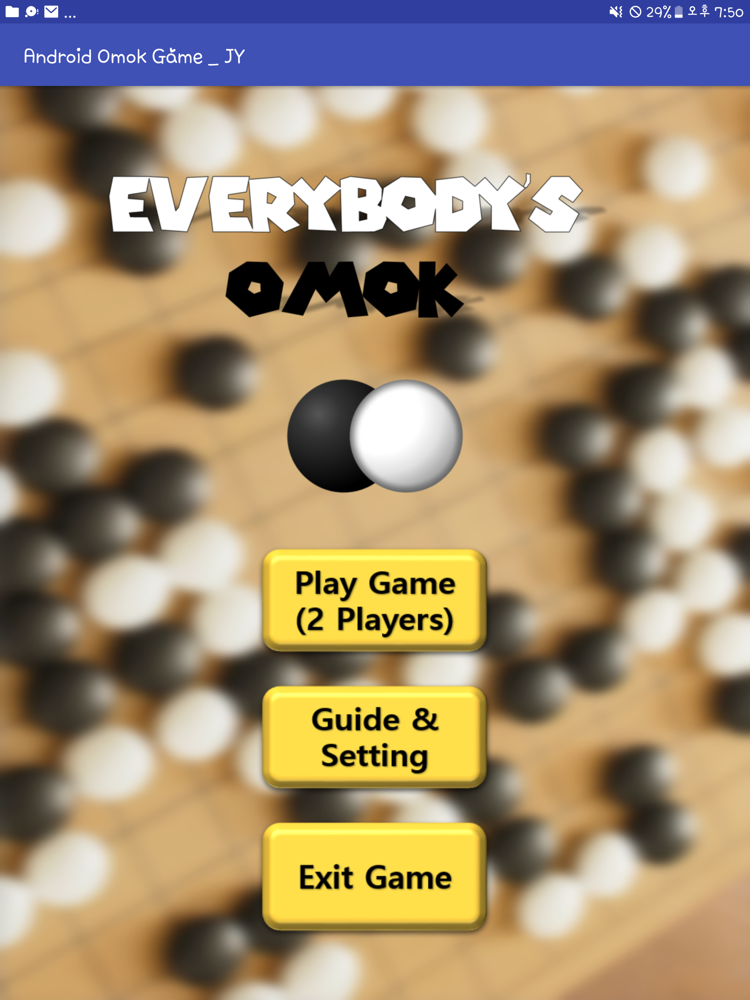 | 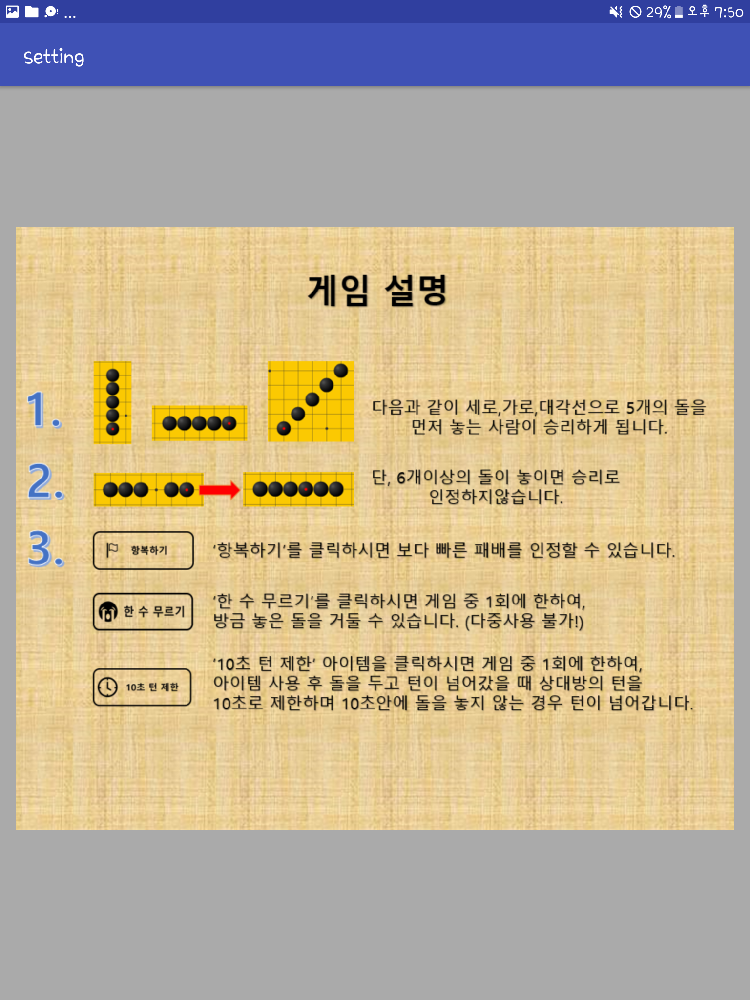 | 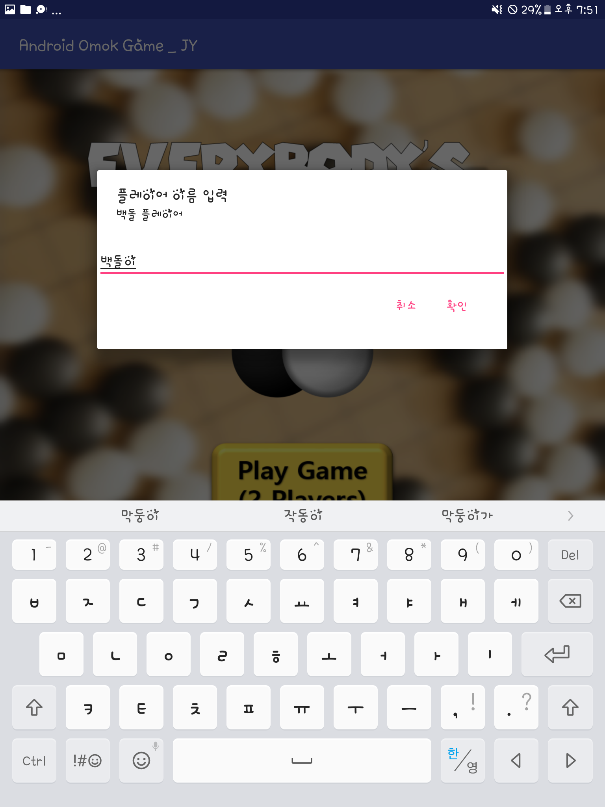 |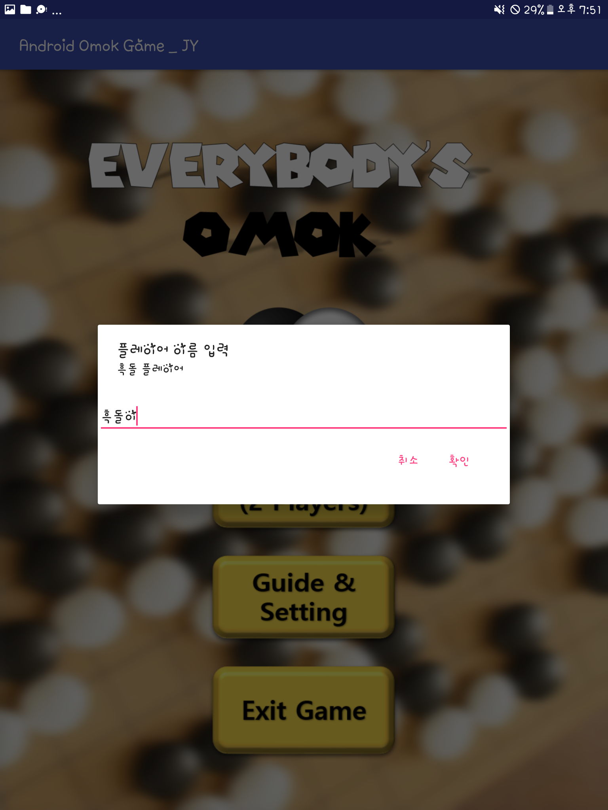|
|:---:|:---:|:---:|:---:|
| 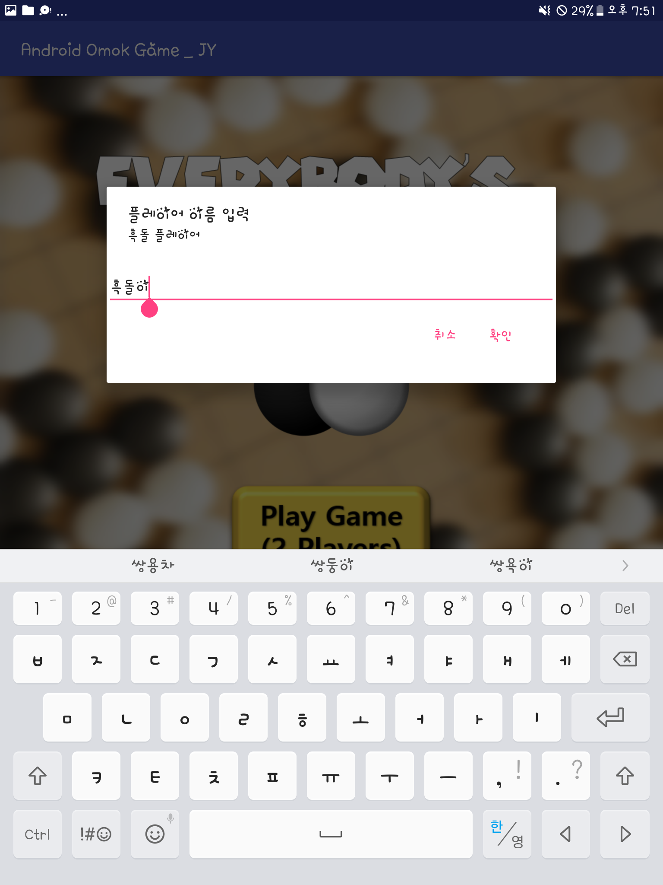 | 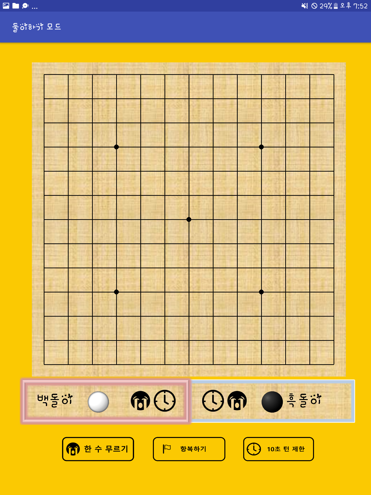 |  |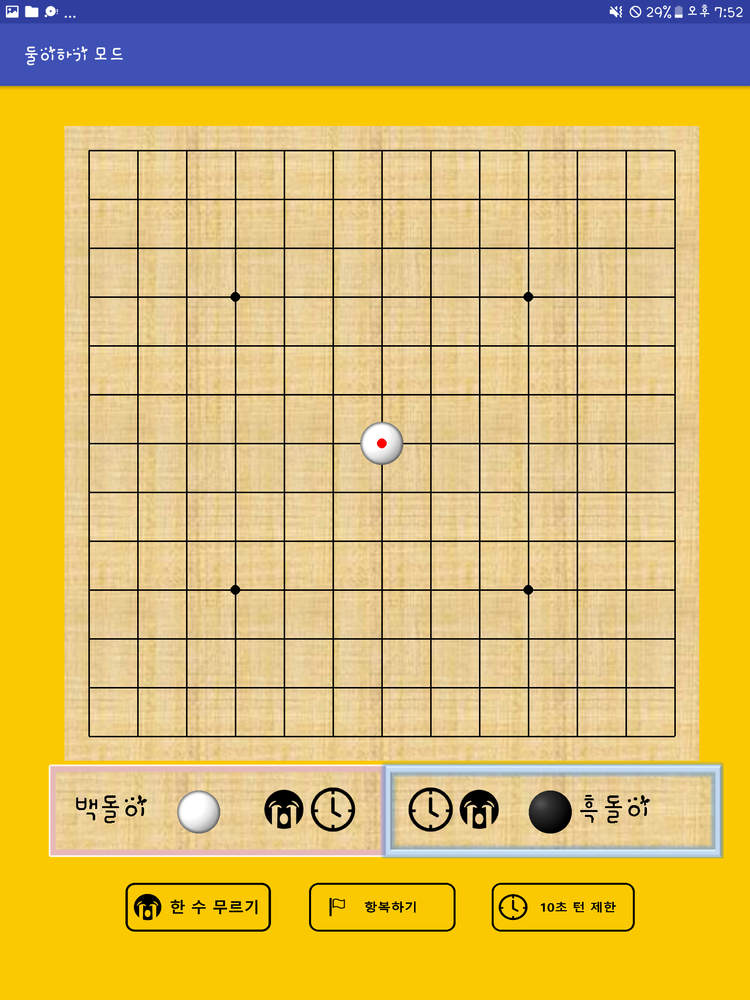|
| 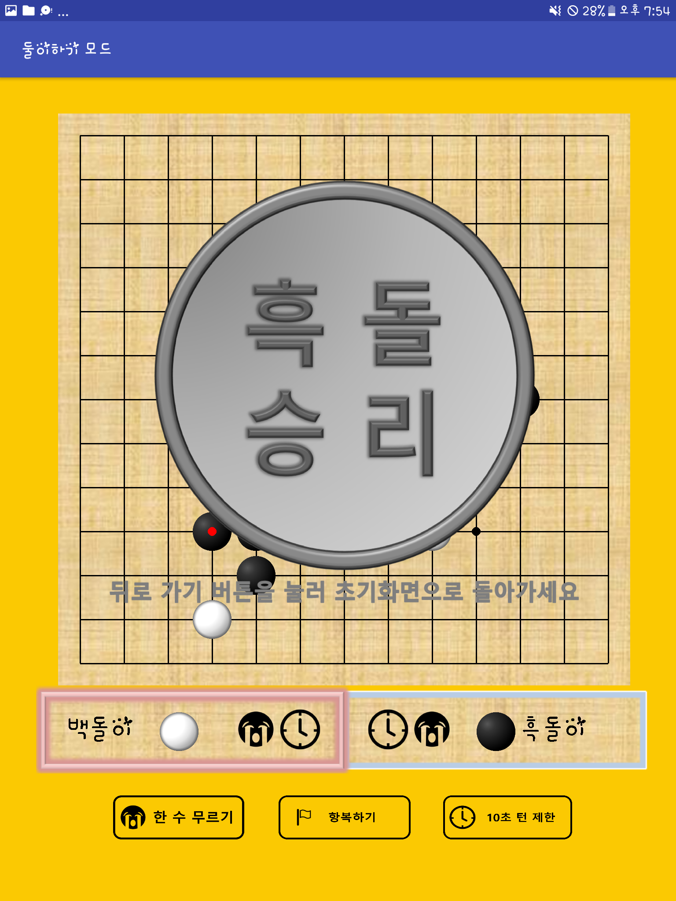 | 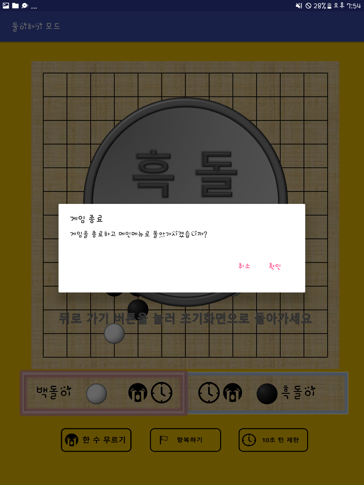 | 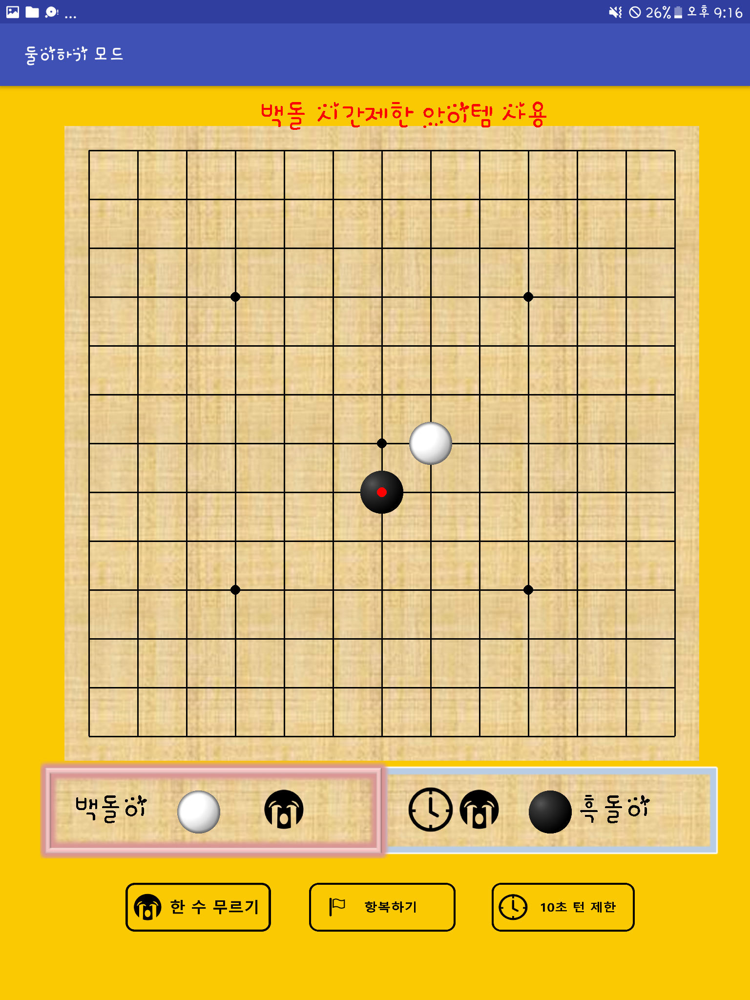 ||
|  | 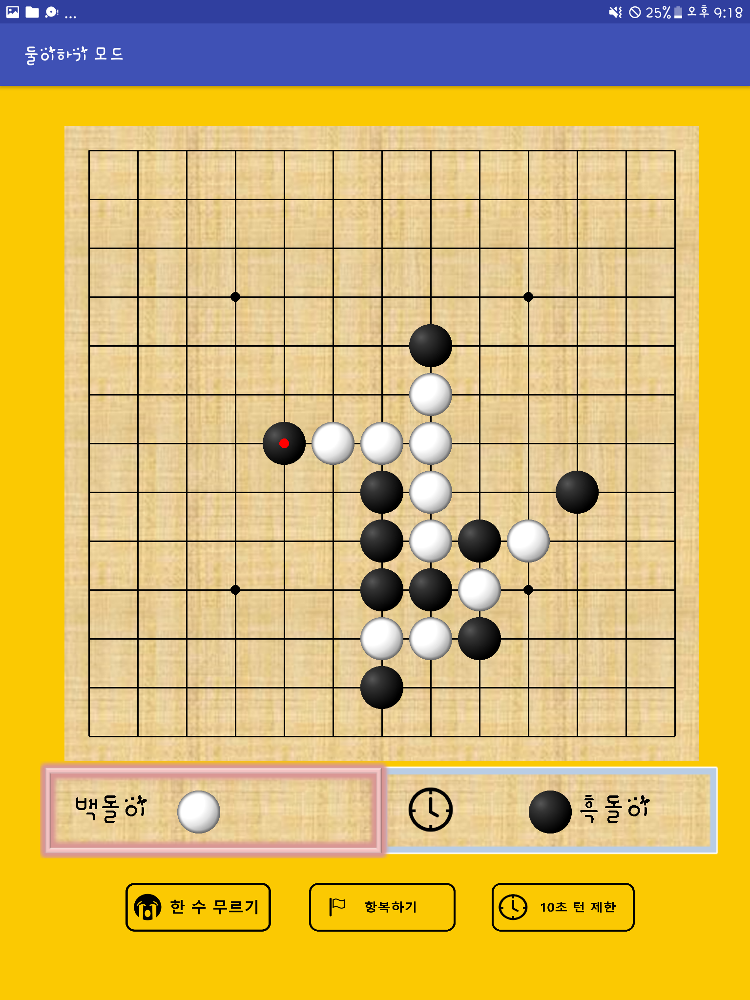 | 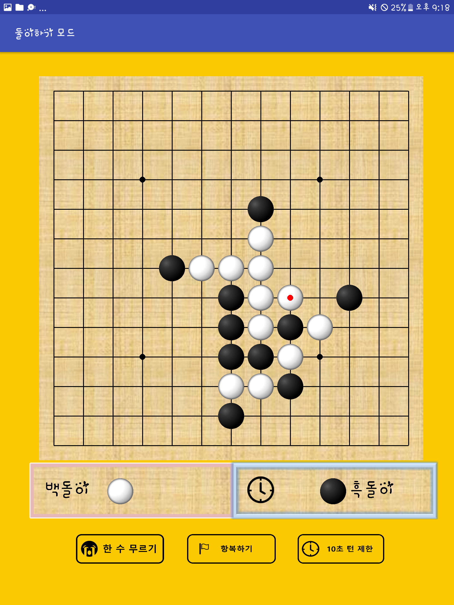 ||
| 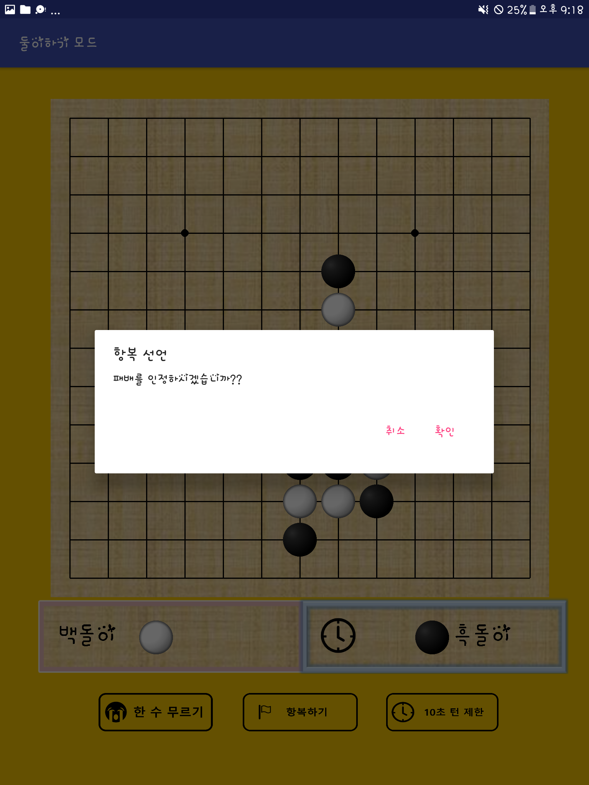 ||||
